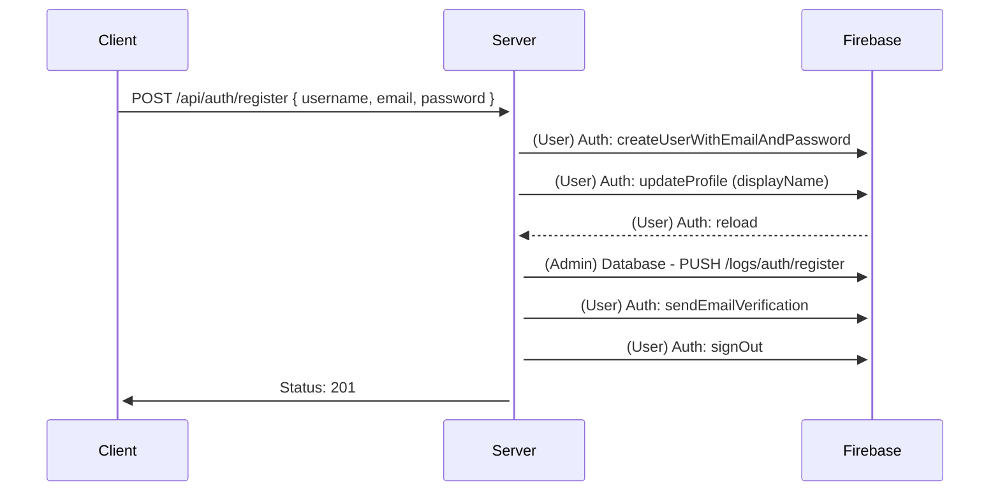
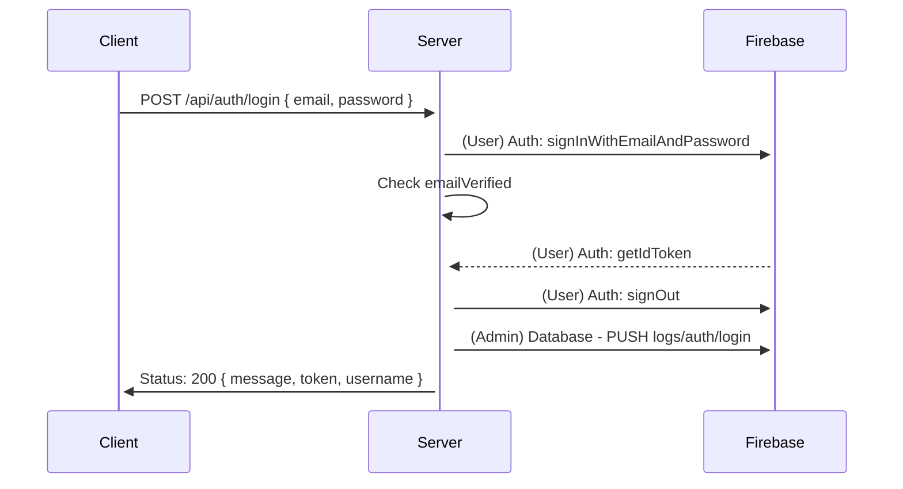
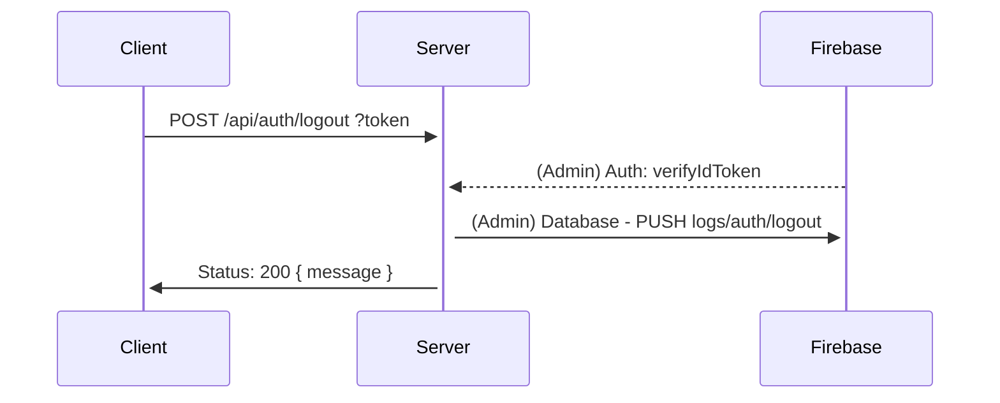
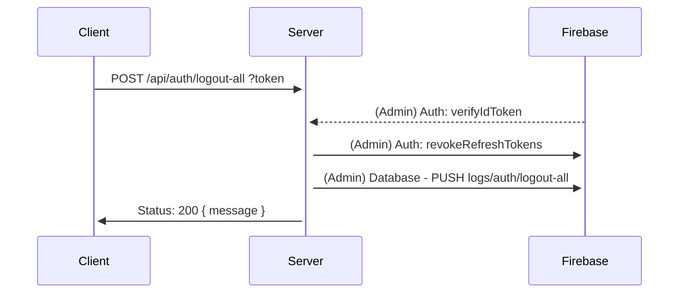
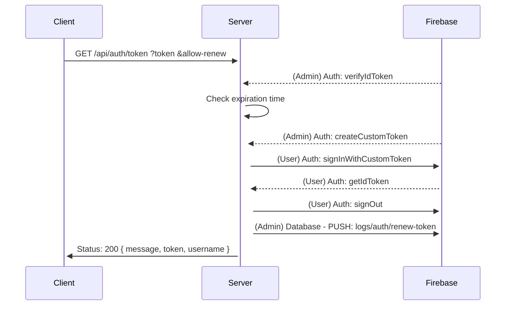
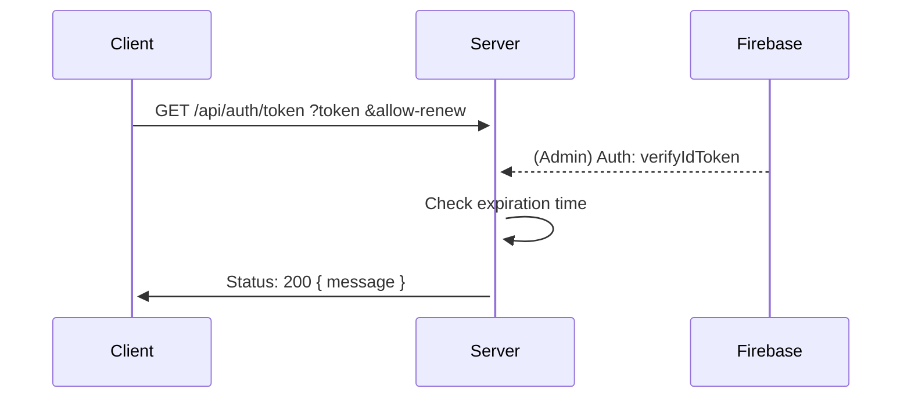
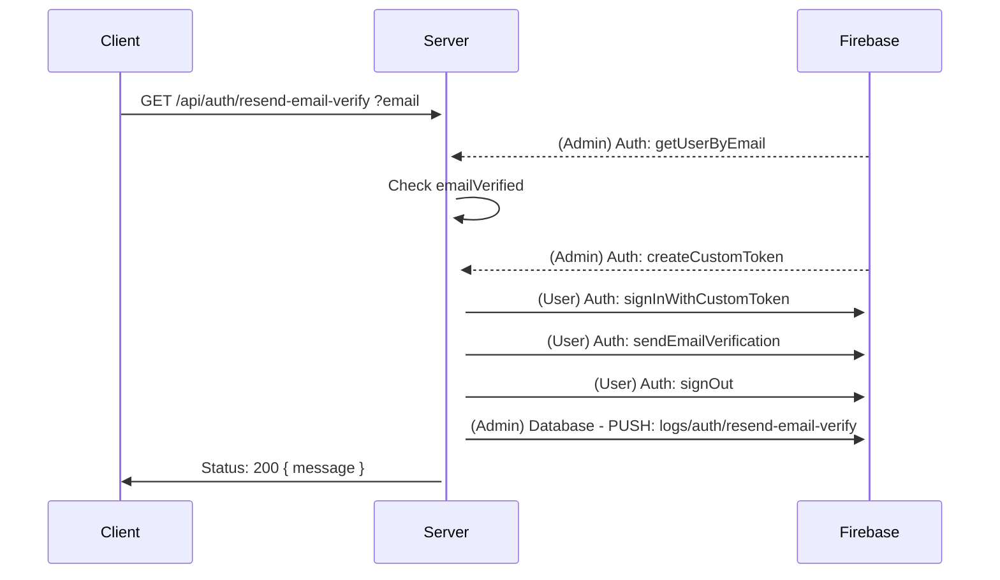
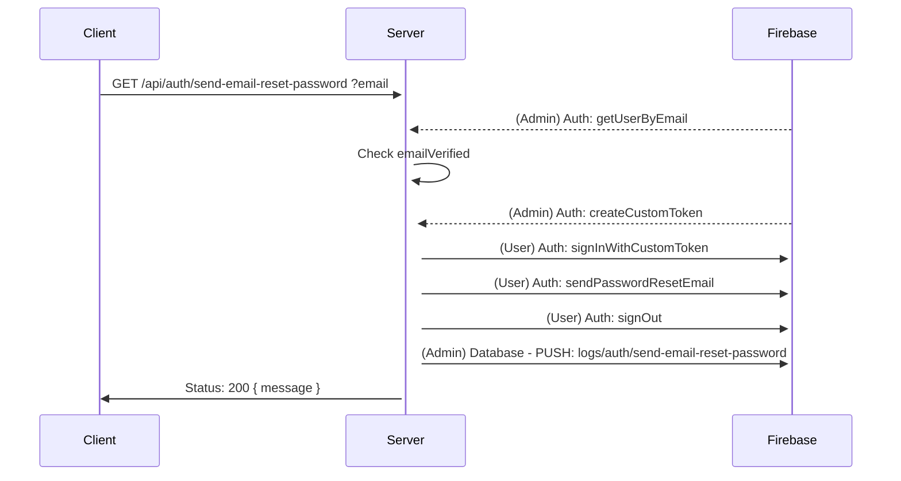

# Authentication Flow and API

## API tree

```
api
└─── auth
     ├─── login
     ├─── logout
     ├─── logout-all
     ├─── register
     ├─── resend-email-verify
     ├─── send-email-reset-password
     └─── token
```

---

## Register



### POST /api/auth/register

```json
{
    username: "string",
    email: "string",
    password: "string"
}
```

### Response

| Status | Message | Data | Description |
| --- | --- | --- | --- |
| 201 | ok | `{ message }` ||
| 400 | weak_password | `{ message }` | Password should be at least 6 characters |
| 400 | bad_request | `{ message, invalids: { username, email, password } }` | Variable in `invalids` is boolean |
| 409 | email_already_in_use | `{ message }` | This email has already been taken |

---

## Login



### POST /api/auth/login

```json
{
    email: "string",
    password: "string"
}
```

### Response

| Status | Message | Data | Description |
| --- | --- | --- | --- |
| 200 | ok | `{ message, token, username }` ||
| 400 | bad_request | `{ message, invalids: { email, password } }` | Variable in `invalids` is boolean |
| 401 | email_not_found | `{ message }` | This email address could not be found |
| 401 | wrong_password | `{ message }` | Incorrect password |
| 401 | email_not_verified | `{ message }` | Your email is not verified |
| 403 | account_suspended | `{ message }` | Your account is suspended |

---

## Logout



### POST /api/auth/logout?token=

| Variable | Type |
| --- | --- |
| token | string |

### Response

| Status | Message | Data | Description |
| --- | --- | --- | --- |
| 200 | ok | `{ message }` | This isn't actually revoke token, it's just telling log and please stop using that token. The token will expire in 1 hour. |
| 400 ||| Bad request |
| 404 ||| Token not found or token revoked |

---

## Logout All



### POST /api/auth/logout-all?token=

| Variable | Type |
| --- | --- |
| token | string |

### Response

| Status | Message | Data | Description |
| --- | --- | --- | --- |
| 200 | ok | `{ message }` | This will revoke all tokens from that account, effective immediately. |
| 400 ||| Bad request |
| 404 ||| Token not found or token revoked |

---

## Verify Token

#### allow-renew = true



#### allow-renew = false



### GET /api/auth/token?token=&allow-renew=

| Variable | Type |
| --- | --- |
| token | string |
| allow-renew | true / false |

### Response

| Status | Message | Data | Description |
| --- | --- | --- | --- |
| 200 | ok | `{ message }` ||
| 200 | renew | `{ message, token, username }` | Token to be used next time |
| 400 ||| Bad request |
| 404 ||| Token not found |

---

## Send email to verify email



### POST /api/auth/resend-email-verify?email=

| Variable | Type |
| --- | --- |
| email | string |

### Response

| Status | Message | Data | Description |
| --- | --- | --- | --- |
| 200 | ok | `{ message }` ||
| 200 | account_verified | `{ message }` | The account is already verified |
| 403 | account_suspended | `{ message }` | Your account is suspended |
| 404 | email_not_found | `{ message }` | This email address could not be found |
| 429 | too_many_requests | `{ message }` | Too many request |
| 500 | internal_server_error | `{ message }` | Internal server error |

---

## Send email to reset password



### POST /api/auth/send-email-reset-password?email=

| Variable | Type |
| --- | --- |
| email | string |

### Response

| Status | Message | Data | Description |
| --- | --- | --- | --- |
| 200 | ok | `{ message }` ||
| 403 | account_suspended | `{ message }` | Your account is suspended |
| 404 | email_not_found | `{ message }` | This email address could not be found |
| 500 | internal_server_error | `{ message }` | Internal server error |
